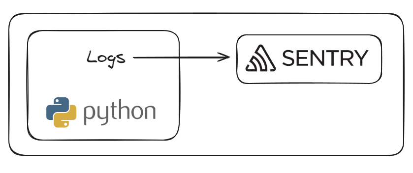
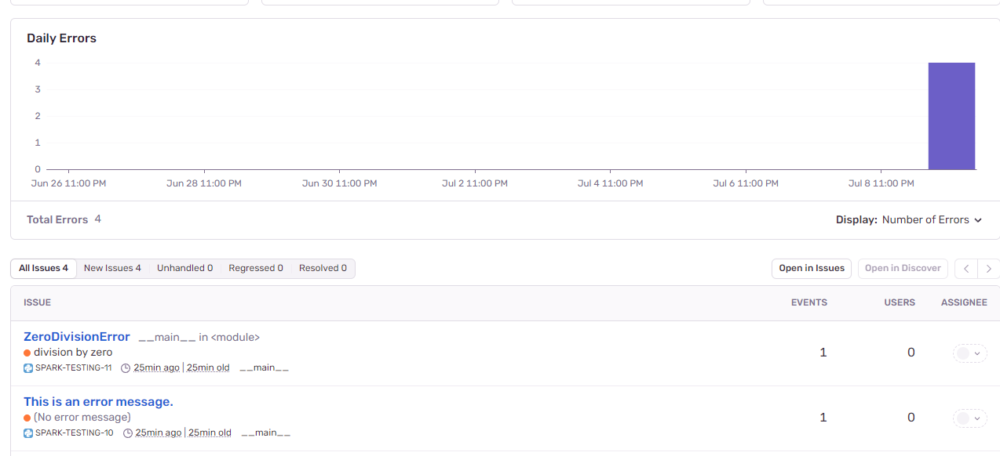

# Monitoring Log with Sentry
Monitorando os logs da aplicação com o Sentry.

## Arquitetura


--------------------------------------------------
## Pré-requisitos
* Conta no Sentry
* Python
* Libs Python

## Como desbloquear os pré-requisitos?

### Criar conta no Sentry 

https://sentry.io/signup/

Com a contra criada, crie um projeto, copie e cole seu ```DNS``` no arquivo ```.env```

### Instalação do Python

https://www.python.org/downloads/

### Libs Python
Crie o ambiente virtual:
```
python3 -m venv venv
```
Ative o ambiente virtual (Linux):
```
source venv/bin/activate
```
Instale as libs necessárias:
```
pip install -r requirements.txt
```
--------------------------------------------------

## Como simular o log?
Execute o programa ```app-python.py```

Sample:


--------------------------------------------------
## Conclusão
Parabéns! Seu log já está sendo enviado para o Sentry! 

## Referência
https://docs.sentry.io/

## Developer
| Desenvolvedor      | LinkedIn                                   | Email                        | Portfólio                              |
|--------------------|--------------------------------------------|------------------------------|----------------------------------------|
| Wallace Camargo    | [LinkedIn](https://www.linkedin.com/in/wallace-camargo-35b615171/) | wallacecpdg@gmail.com        | [Portfólio](https://wlcamargo.github.io/)   |


